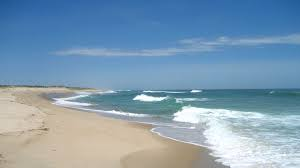

Cape Cod:   
  
`Cape Cod: `

######### **Balance the Equation:**
CH~4~ + 4CL~2~ --> CCL~4~ +4HCL

Biology       | Chemistry
------------- | -------------
BIOL 0140     | CHEM 0270
BIOL 0145     | CHEM 0322

Area of a circle: $A = \pi*r^{2}$   
Area of a cylinder: $A = (2*\pi*r*h) + (2\pi*r^{2})$  

I am *happy* that Professor Ash made us a class **playlist**

### Favorite Movies:
1. The Dark Knight Rises  
2. Limitless  
3. La La Land  
4. Good Will Hunting  
5. The Social Network  

##### Things to do before J Term ends:
* Pond Hockey  
* Ski  
  + Sugarbush  
  + Stowe  
* Finalize Spring Housing  
* Paint by numbers  

[A Fun Site](https://mrdoob.com/projects/chromeexperiments/google-gravity/)

