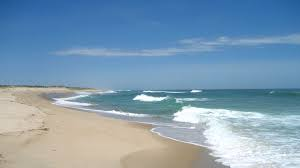

A Picture to Help you through a Long Winter (Cape Cod):   
 

Hello! My name is Jack Eschert; this is my class portfolio page for my J Term course, BIOL 1007A: Reproducible Biology in R. Here you can find my assignments by link below:

# Assignments 

### *Daily Assignments*

[Assignment 1](Assignment-1.html)  

[Assignment 2](Assignment-2.html)  

[Assignment 3](Assignment-3.html)

[Assignment 4](Assignment-4.html)

[Assignment 5](Assignment-5.html)

[Assignment 6](Assignment-6.html)

[Assignment 7](Assignment-7.html)

### *Weekly Assignments*

[Weekly Assignment 1](Weekly-Assignment-1.html)

[Weekly Assignment 3](Weekly-Assignment-3.html)